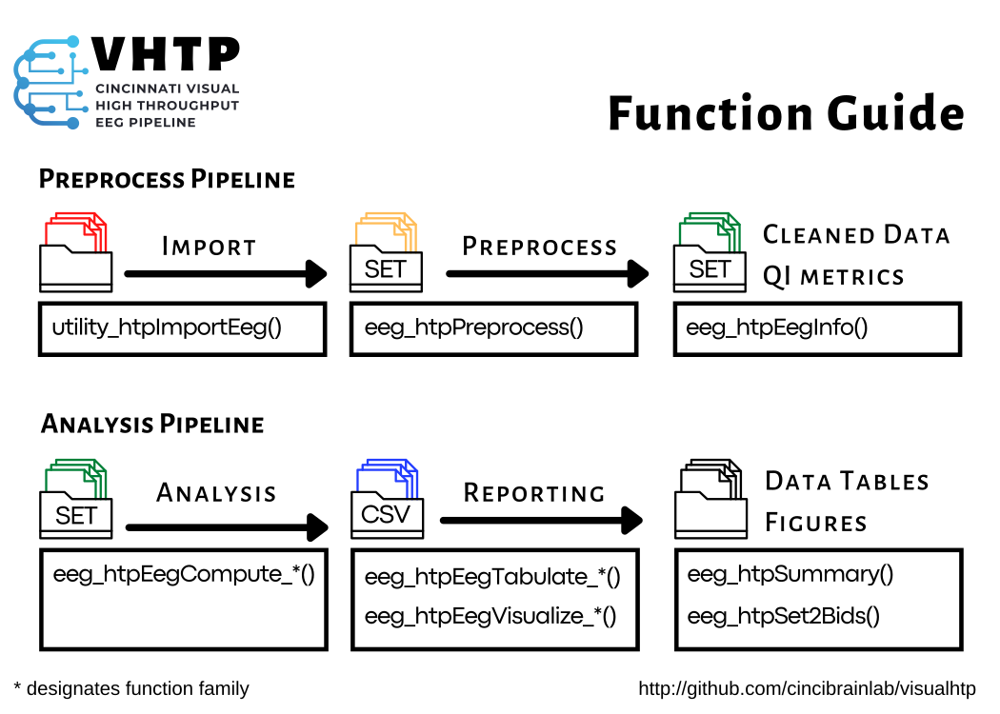

<!-- badges: start -->

<!-- badges: end -->

## Introduction
With the **vhtp** toolbox, anyone can easily work with EEG data using MATLAB-Octave programming language. The **vhtp** philosophy: You can produce ready-to-use EEG outputs with a **simple set of functions** that implement your favorite EEG toolkits. 

## Key Features
Is there room for another opensource EEG toolkit? The **vhtp** toolkit focuses on clean *implementation* and *reporting* of EEG analysis. **vhtp** implements wrappers around functions from all major EEG toolkits including EEGLAB, Fieldtrip, and Brainstorm.
  - **Centered around SET:** Every core function in **vhtp** uses an **EEGLAB SET** structure as an input, output, or both. Example: *utility_htpImportEeg* converts a directory of original EEG files into SET files.
  - **Extensible:** The EEGLAB SET structure is a common format across a variety of EEG systems and direct access to data. Therefore, any custom or external toolbox code can easily be incorporated into template functions. Example: *eeg_htpCalcChirpItcErsp* uses EEGLAB function newtimef to calculate intratrial coherence and event-related spectral pertubation. 
  - **Comprehensive pipeline**: **vhtp** includes functions for import, preprocessing, analysis, and visualization.
  - **High Throughput:** Our research team has collected over 4,000 dense-array EEGs. We have implemented parallel processing, batch preprocessing processing, and binary/CUDA independent component analysis to handle large batch jobs.
  - **Highly visual:** Viewing data and intermediate results is essential to high quality EEG analysis. Visual tools are implemented at every step of a **vhtp** pipeline. Example: utility_htpImportEeg outputs a topographic PNG file of channel locations for manual verifiction. eeg_htpPreprocessStage4 uses a custom GUI and toolboxes to provide dipole, topographic, timeseries views for artifact rejection.
  - **Export to R:** The default output of **vhtp** functions are CSV files and cut-and-paste R data dictionary for import. 
  - **Focus on quality control and audit:** From each function, CSV tables are produced, tracking timestamps and processing details. Tools are included to extract key information (i.e., removed components) from a directory of SET files for reporting.
  - **Clinical Focus:** We have implemented this pipeline for the analysis of clinical trial data which requires approaches such as blinded preprocessing and compliance to specific FDA Part 11 code.
  - **Export to BIDS:** Following import to SET, data directories confirming to EEG BIDS specifications can be created for sharing.

## Installation

    git clone http://github.org/cincibrainlab/visualhtp

## Resources

### Documentation

Function help is located here: TBD

Specific workflows are available at: TBD

A gallery of screenshots is available here: TBD

### Getting help

This project is developed and maintained on our own time. If you have
questions about how to use the package, please email us.

## Contributing to the package

### Code of Conduct

Anyone getting involved in this package agrees to our [Code of
Conduct](https://github.com/davidgohel/flextable/blob/master/CONDUCT.md).

### Bug reports

When you file a [bug
report](https://github.com/cincibrainlab/visualhtp/issues), please spend
some time making it easy for me to follow and reproduce. The more time
you spend on making the bug report coherent, the more time we can
dedicate to investigate the bug as opposed to the bug report.
